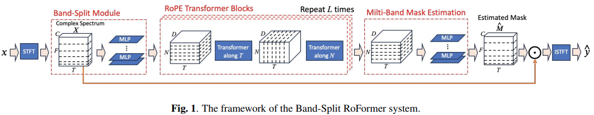

## Lossless BS-RoFormer

- Inference script (modified from <a href="https://github.com/ZFTurbo/Music-Source-Separation-Training">ZFTurbo/Music-Source-Separation-Training</a>)
- Lossless mode (no audio content is lost in the separation process)
- Partial MPS support (2x faster than CPU)

### Install

You can download the pre-trained model from <a href="https://github.com/ZFTurbo/Music-Source-Separation-Training/releases/tag/v1.0.12">ZFTurbo/Music-Source-Separation-Training</a> and put it in the `bs_roformer` folder. It will be downloaded automatically if it is not found and no model is specified.

```bash
$ python3 -m pip install -e .
```

### Run

On a single file with the default arguments:

```bash
$ python3 -m bs_roformer input.wav
```

Or on a folder with multiple files with custom arguments:

```bash
$ python3 -m bs_roformer --model_type bs_roformer --start_check_point bs_roformer/model_bs_roformer_ep_17_sdr_9.6568.ckpt --config_path bs_roformer/config_bs_roformer_384_8_2_485100.yaml --input_folder input --output_folder output
```

## Lossless mode

The `--lossless` flag enables perfect reconstruction of the original mix by intelligently distributing any residual content back into the stems. This ensures that when all stems are summed together, they exactly match the input mix.

By default, music source separation can be slightly lossy -- the sum of the separated stems may not perfectly equal the original mix due to model limitations. The lossless mode addresses this by:

1. Calculating the residual (difference between original mix and sum of stems)
2. Running the model again on this residual to classify its content
3. Using a hybrid approach to distribute the residual:
   - Clear drum/percussion content goes to the drums stem
   - Clear musical/harmonic content goes to the other stem
   - Ambiguous content is distributed proportionally based on the energy ratio

This results in:

- Perfect reconstruction when stems are summed
- Musically appropriate distribution of residual content
- Minimal impact on separation quality of primary elements

### Usage

To use lossless mode, simply add the `--lossless` flag to your command:

```bash
$ python3 -m bs_roformer --lossless input.wav
```

Note that this will run the model twice, so it will be 2x slower than the default mode.

---

</img>

## BS-RoFormer

Implementation of <a href="https://arxiv.org/abs/2309.02612">Band Split Roformer</a>, SOTA Attention network for music source separation out of ByteDance AI Labs. They beat the previous first place by a large margin. The technique uses axial attention across frequency (hence multi-band) and time. They also have experiments to show that rotary positional encoding led to a huge improvement over learned absolute positions.

It also includes support for stereo training and outputting multiple stems.

Please join <a href="https://discord.gg/xBPBXfcFHd"></a> if you are interested in replicating a SOTA music source separator out in the open

Update: This paper has been replicated by <a href="https://github.com/ZFTurbo">Roman</a> and weight open sourced <a href="https://github.com/ZFTurbo/Music-Source-Separation-Training?tab=readme-ov-file#vocal-models">here</a>

Update 2: Used for <a href="https://www.youtube.com/watch?v=rboAdham380">this Katy Perry remix!</a>

Update 3: <a href="https://github.com/KimberleyJensen">Kimberley Jensen</a> has open sourced a MelBand Roformer trained on vocals <a href="https://github.com/KimberleyJensen/Mel-Band-Roformer-Vocal-Model">here</a>!

## Appreciation

- <a href="https://stability.ai/">StabilityAI</a> and <a href="https://huggingface.co/">🤗 Huggingface</a> for the generous sponsorship, as well as my other sponsors, for affording me the independence to open source artificial intelligence.

- <a href="https://github.com/shenberg">Roee</a> and <a href="https://github.com/faroit">Fabian-Robert</a> for sharing their audio expertise and fixing audio hyperparameters

- <a href="https://github.com/chenht2010">@chenht2010</a> and <a href="https://github.com/ZFTurbo">Roman</a> for working out the default band splitting hyperparameter!

- <a href="https://github.com/dorpxam">Max Prod</a> for reporting a big bug with Mel-Band Roformer with stereo training!

- <a href="https://github.com/ZFTurbo">Roman</a> for successfully training the model and open sourcing his training code and weights at <a href="https://github.com/ZFTurbo/Music-Source-Separation-Training">this repository</a>!

- <a href="https://github.com/crlandsc">Christopher</a> for fixing an issue with multiple stems in Mel-Band Roformer

- <a href="https://github.com/iver56">Iver Jordal</a> for identifying that the default stft window function is not correct

## Install

```bash
$ pip install BS-RoFormer
```

## Usage

```python
import torch
from bs_roformer import BSRoformer

model = BSRoformer(
    dim = 512,
    depth = 12,
    time_transformer_depth = 1,
    freq_transformer_depth = 1
)

x = torch.randn(2, 352800)
target = torch.randn(2, 352800)

loss = model(x, target = target)
loss.backward()

# after much training

out = model(x)
```

To use the Mel-Band Roformer proposed in <a href="https://arxiv.org/abs/2310.01809">a recent follow up paper</a>, simply import `MelBandRoformer` instead

```python
import torch
from bs_roformer import MelBandRoformer

model = MelBandRoformer(
    dim = 32,
    depth = 1,
    time_transformer_depth = 1,
    freq_transformer_depth = 1
)

x = torch.randn(2, 352800)
target = torch.randn(2, 352800)

loss = model(x, target = target)
loss.backward()

# after much training

out = model(x)
```

## Todo

- [x] get the multiscale stft loss in there
- [x] figure out what `n_fft` should be
- [x] review band split + mask estimation modules

## Citations

```bibtex
@inproceedings{Lu2023MusicSS,
    title   = {Music Source Separation with Band-Split RoPE Transformer},
    author  = {Wei-Tsung Lu and Ju-Chiang Wang and Qiuqiang Kong and Yun-Ning Hung},
    year    = {2023},
    url     = {https://api.semanticscholar.org/CorpusID:261556702}
}
```

```bibtex
@inproceedings{Wang2023MelBandRF,
    title   = {Mel-Band RoFormer for Music Source Separation},
    author  = {Ju-Chiang Wang and Wei-Tsung Lu and Minz Won},
    year    = {2023},
    url     = {https://api.semanticscholar.org/CorpusID:263608675}
}
```

```bibtex
@misc{ho2019axial,
    title  = {Axial Attention in Multidimensional Transformers},
    author = {Jonathan Ho and Nal Kalchbrenner and Dirk Weissenborn and Tim Salimans},
    year   = {2019},
    archivePrefix = {arXiv}
}
```

```bibtex
@misc{su2021roformer,
    title   = {RoFormer: Enhanced Transformer with Rotary Position Embedding},
    author  = {Jianlin Su and Yu Lu and Shengfeng Pan and Bo Wen and Yunfeng Liu},
    year    = {2021},
    eprint  = {2104.09864},
    archivePrefix = {arXiv},
    primaryClass = {cs.CL}
}
```

```bibtex
@inproceedings{dao2022flashattention,
    title   = {Flash{A}ttention: Fast and Memory-Efficient Exact Attention with {IO}-Awareness},
    author  = {Dao, Tri and Fu, Daniel Y. and Ermon, Stefano and Rudra, Atri and R{\'e}, Christopher},
    booktitle = {Advances in Neural Information Processing Systems},
    year    = {2022}
}
```

```bibtex
@article{Bondarenko2023QuantizableTR,
    title   = {Quantizable Transformers: Removing Outliers by Helping Attention Heads Do Nothing},
    author  = {Yelysei Bondarenko and Markus Nagel and Tijmen Blankevoort},
    journal = {ArXiv},
    year    = {2023},
    volume  = {abs/2306.12929},
    url     = {https://api.semanticscholar.org/CorpusID:259224568}
}
```

```bibtex
@inproceedings{ElNouby2021XCiTCI,
    title   = {XCiT: Cross-Covariance Image Transformers},
    author  = {Alaaeldin El-Nouby and Hugo Touvron and Mathilde Caron and Piotr Bojanowski and Matthijs Douze and Armand Joulin and Ivan Laptev and Natalia Neverova and Gabriel Synnaeve and Jakob Verbeek and Herv{\'e} J{\'e}gou},
    booktitle = {Neural Information Processing Systems},
    year    = {2021},
    url     = {https://api.semanticscholar.org/CorpusID:235458262}
}
```

```bibtex
@inproceedings{Zhou2024ValueRL,
    title   = {Value Residual Learning For Alleviating Attention Concentration In Transformers},
    author  = {Zhanchao Zhou and Tianyi Wu and Zhiyun Jiang and Zhenzhong Lan},
    year    = {2024},
    url     = {https://api.semanticscholar.org/CorpusID:273532030}
}
```
